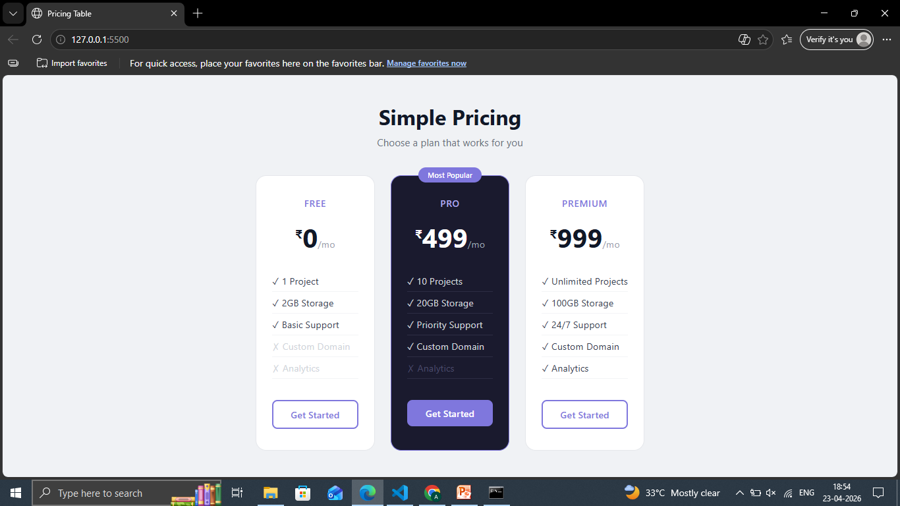

# Day 03 — Pricing Table

A responsive 3-column pricing table with a highlighted popular plan, built with pure HTML and CSS.

## Preview

## Features
- 3-tier pricing layout using CSS Grid
- Highlighted "Most Popular" card
- Hover lift effect on cards
- Responsive — stacks to 1 column on mobile
- Disabled feature styling

## Tech Stack
- HTML5
- CSS3 (Grid, transitions, responsive design)

## What I Learned
- CSS Grid for multi-column card layouts
- Using position absolute for badge overlays
- Responsive design with media queries

## Part of
[30 Days 30 Projects](https://github.com/anmisha-dash/30-days-30-projects) challenge
